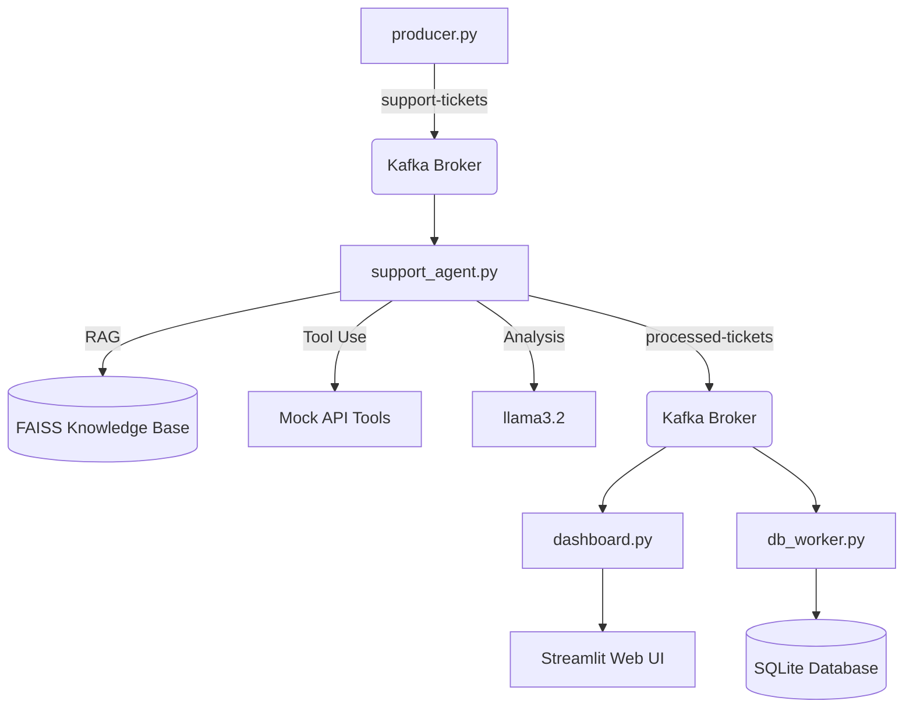

# Kafka LLM Support Agent 🚀

This repository contains a real-time, event-driven Customer Support AI Agent. It uses **Kafka** for message streaming, **LangGraph** for advanced workflow orchestration, and local **Ollama** models for RAG-powered, agentic decision making.

## 🏗️ Architecture



1. **Producer (`producer.py`)**: Streams custom JSON support tickets (Billing, Tech, General) into the `support-tickets` Kafka topic.
2. **Support Agent (`support_agent.py`)**: A LangGraph application that:
    - Analyzes Sentiment and Category.
    - Retrieves context from a FAISS vector store (**RAG**).
    - Executes **Tools** (Refunds, Escalations) based on policy.
    - Publishes processed results to a new `processed-tickets` topic.
3. **Database Worker (`db_worker.py`)**: A dedicated Kafka consumer that listens to processed tickets and writes them to a local **SQLite** database (`support_tickets.db`).
4. **Live Dashboard (`dashboard.py`)**: A Streamlit interface that visualizes real-time decisions from Kafka and historical data from the Database.

## 🛠️ Tech Stack
- **Streaming**: Apache Kafka (Docker)
- **Orchestration**: LangGraph
- **LLM / Embeddings**: Ollama (`llama3.2`, `nomic-embed-text`)
- **Vector DB**: FAISS
- **UI**: Streamlit

## 🚀 Setup Instructions

1. **Start Kafka**:
   ```bash
   docker-compose up -d
   ```

2. **Prepare the Knowledge Base (RAG)**:
   ```bash
   python build_vectorstore.py
   ```

3. **Run the Agent**:
   ```bash
   python support_agent.py
   ```

4. **Launch the Dashboard**:
   ```bash
   streamlit run dashboard.py
   ```

5. **Send Tickets**:
   ```bash
   python producer.py
   ```

---

## 📚 Evolution Log

### Phase 1: Retrieval-Augmented Generation (RAG)
* **What I Did**: Connected the agent to a local Knowledge Base (`faq.txt`).
* **Technical details**: Used `OllamaEmbeddings` and `FAISS` to index company policies. Added a `retrieve_context` node to the LangGraph to ensure the AI bases its decisions on ground-truth company rules.

### Phase 2: Agentic Tool Use (Function Calling)
* **What I Did**: Empowered the agent to *act*, not just talk.
* **Technical details**: Defined `@tool` decorated functions for `refund_customer` and `escalate_to_human`. Refactored the LangGraph with `ToolNode` and deterministic routing to bypass the reasoning limitations of small local models (3B).

### Phase 3: Live Real-Time Dashboard
* **What I Did**: Moved AI logs from the terminal to a professional web UI.
* **Technical details**: Built a Streamlit app that consumes from a secondary `processed-tickets` Kafka topic. Used a polled consumer architecture to safely update `st.session_state` and render beautiful cards for each AI decision.

### Phase 4: Database Persistence
* **What I Did**: Added a historical storage layer to prevent data loss.
* **Technical details**: Implemented a standalone `db_worker.py` Kafka consumer that persists every AI decision into a local **SQLite** database. Updated the dashboard to allow switching between "Live" and "Historical" views with persistent lifetime metrics.
